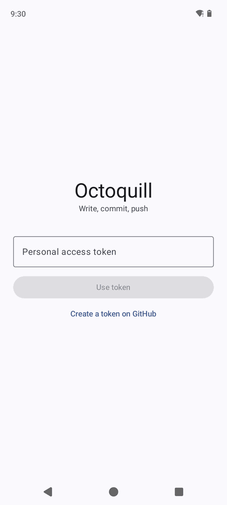
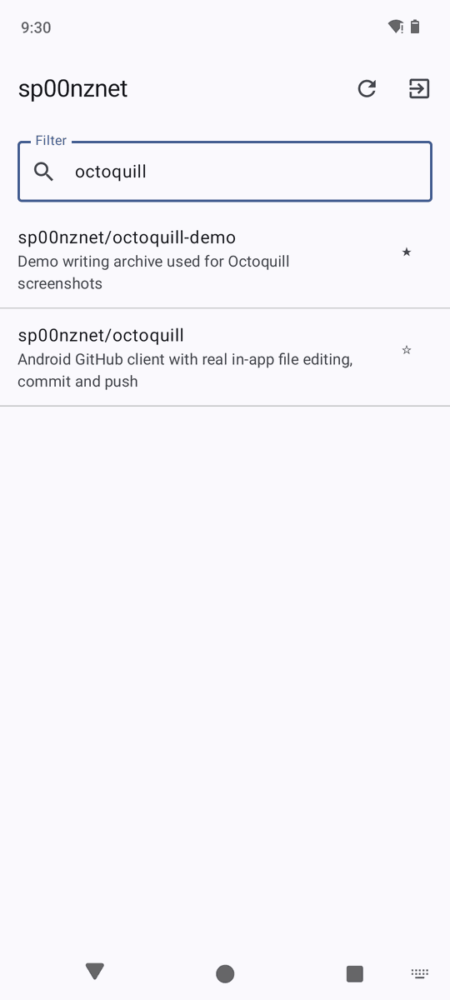
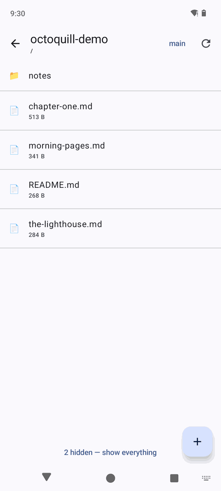
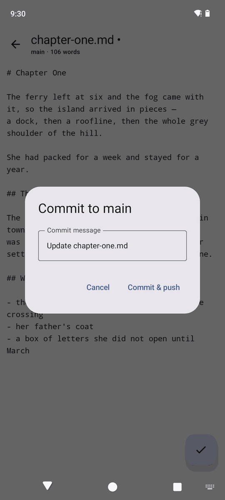
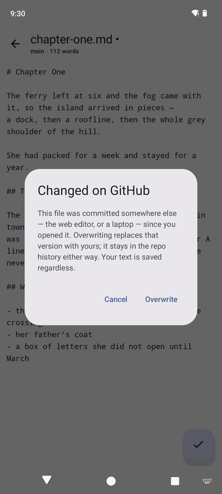

# Octoquill

A phone client for a **writing repo**. Your prose lives in a private GitHub repo as
markdown; Octoquill opens it on your phone, lets you edit in a real text field, attach a
commit message, and push — without a laptop and without a git implementation.

Built against [`writing-archive`](https://github.com/sp00nznet/writing-archive), but it
works for any repo you keep text in: a journal, notes, a manuscript, a wiki, config.

## What it looks like

Captured on a Pixel 6 emulator against a throwaway demo repo — every one of these is the
real app talking to the real GitHub API.

| | | | |
|:--:|:--:|:--:|:--:|
|  |  |  |  |
| Sign in | Star a repo to make it home | Images and binaries hidden | Editing, with live word count |
|  |  |  |  |
| Write the commit message | Pushed — commit sha, straight to the branch | Draft recovered after the app was killed | Someone else committed first |

The last two are the ones worth caring about, and both were triggered for real: the draft
survived a force-stop *and* an APK reinstall, and the conflict came from committing to the
same file from a laptop while the phone had it open.

## Why this one can edit files

Most Android GitHub clients stop at browsing, because "commit and push from a phone"
sounds like it needs JGit, a local clone, a working tree and transport credentials.
It doesn't.

GitHub's **Contents API** does the whole thing server-side in one request:

```
PUT /repos/{owner}/{repo}/contents/{path}
{ "message": …, "content": <base64>, "sha": <blob being replaced>, "branch": … }
```

That single call writes the blob, builds the tree, creates the commit, and moves the
branch ref. No clone, no push, no merge. `Gh.commit()` in `Api.kt` is the entire feature.

Trade-off: **one file per commit**, and no offline browsing. Both are fine for the way
writing actually happens on a phone — you open one piece, work on it, and commit it.

## The two things that will actually bite you

**1. Losing writing.** Android kills backgrounded apps. Two thousand words typed on a
train, never committed, gone. So the editor buffer is mirrored to disk (`Drafts.kt`) on a
600ms debounce and again on `onStop()`, and is only cleared once the commit lands. Reopen
a file with an uncommitted draft and you get *"Unsaved writing found — keep mine / use
GitHub version"*. Drafts deliberately survive sign-out.

**2. Editing in two places.** `writing-archive`'s own README says it: *"Edit in one place
at a time. If you commit from the GitHub web editor, say so, so the next local session
pulls first."* The phone makes that a third location. The Contents API's `sha` parameter
is the guard — GitHub rejects a commit built on a stale blob rather than clobbering:

| situation | status | what the app does |
|---|---|---|
| file changed on GitHub since you opened it | `409` | *Changed on GitHub* → Overwrite / Cancel |
| new-file path onto a file that already exists | `422` | same dialog |

**Overwrite** re-fetches the current sha and commits on top; the other version stays in
the repo history. Either way your text is on disk, so nothing is lost while you decide.
Both status codes are asserted in the check script — the recovery dialog keys on them.

## Everything else it does

- **Sign in with GitHub** (OAuth device flow) or paste a personal access token
- **Star a repo** to make it home — the app opens straight into it next launch
- **Hides images and binaries** by default; a writing repo is mostly prose, and
  `writing-archive` has 18 JPGs sat in the root. One tap shows everything.
- **Live word count** in the title bar, and a size warning on files big enough to make a
  phone text field lag

## Auth

Two ways in, neither needing a backend server:

1. **Sign in with GitHub** — the app shows a code, you enter it at
   `github.com/login/device`. No redirect URI, no client secret. Needs a one-time OAuth
   App; see below.
2. **Personal access token** — paste a `repo`-scoped token. Zero setup.

Token is stored in app-private `SharedPreferences` with `allowBackup=false`.

### Enabling device-flow sign-in

1. https://github.com/settings/developers → **New OAuth App**
2. Name `Octoquill`, homepage and callback URL can be anything (device flow never uses
   the callback)
3. On the created app tick **Enable Device Flow** and save
4. Put the Client ID in `gradle.properties`:
   ```
   octoquill.clientId=Ov23li...
   ```

Leave it blank and the app shows only the token field.

## Build

```
./gradlew :app:assembleDebug
adb install -r app/build/outputs/apk/debug/app-debug.apk
```

JDK 17+, Android SDK with API 36. `local.properties` points at the SDK.

## Check

```
./tools/check-contents-api.sh <owner>/<repo>
```

Creates, updates, reads back, asserts the 409 and 422 conflict codes, deletes, and
confirms the branch ref moved. Idempotent — safe to re-run. Use a scratch repo.

## Layout

| File | What's in it |
|---|---|
| `Api.kt` | GitHub REST calls + OAuth device flow. All the network code. |
| `Drafts.kt` | Disk mirror of the editor buffer. The anti-data-loss file. |
| `MainActivity.kt` | `Vm` — app state, screen back-stack, and every action. |
| `Screens.kt` | Compose UI: login, repo list, browser, editor, dialogs. |

No DI framework, no navigation library, no repository layer, no git library.

## Found by actually running it

Driving the real app on an emulator turned up two things no amount of reading would have:

- Every file read **`0 KB`** — `size / 1024` truncates, and a writing repo is full of
  200-byte notes. Now shows bytes under 1KB.
- A **transient network failure at startup dumped you to the sign-in screen** with a
  perfectly good token still in prefs — the one screen you cannot act on. Only a `401`
  signs you out now; anything else keeps the session and lets Refresh retry. Opening the
  app on bad signal is the normal case on a phone, so this mattered.

## Not built yet

- **Section editing.** `MANUSCRIPT.md` is 142KB across 65 headings; a phone text field
  will struggle with the whole thing at once. Splitting on headings and committing one
  section back is the obvious fix — worth building the first time it actually gets in the
  way, not before. The feeder files (`napa.md`, `phone-months.md`) are 6–16KB and fine.
- Multi-file commits (needs the Git Data API: blobs → tree → commit → ref)
- Offline browsing — drafts persist, but the file list and file bodies need the network
- Diffs, history, PRs, issues
- Markdown preview, syntax highlighting
- Rename and delete (the Contents API supports delete; nothing calls it yet)
