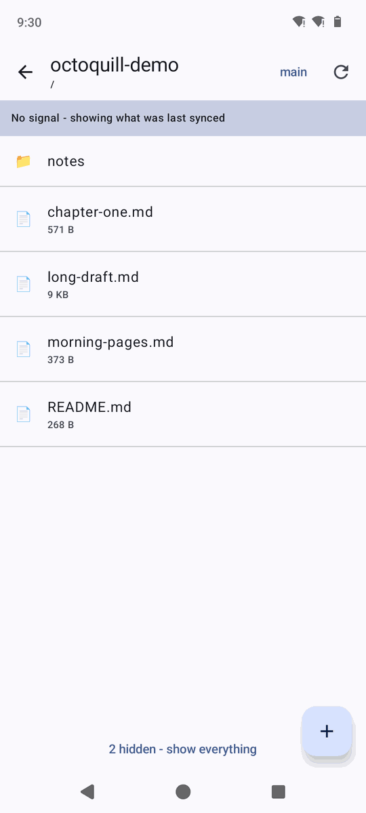
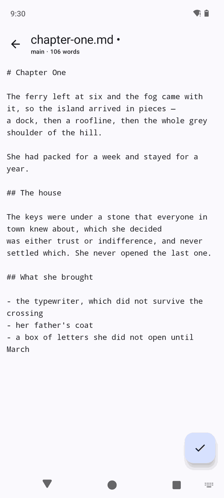
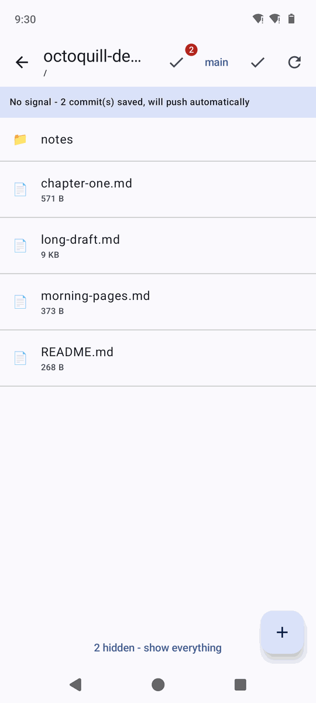
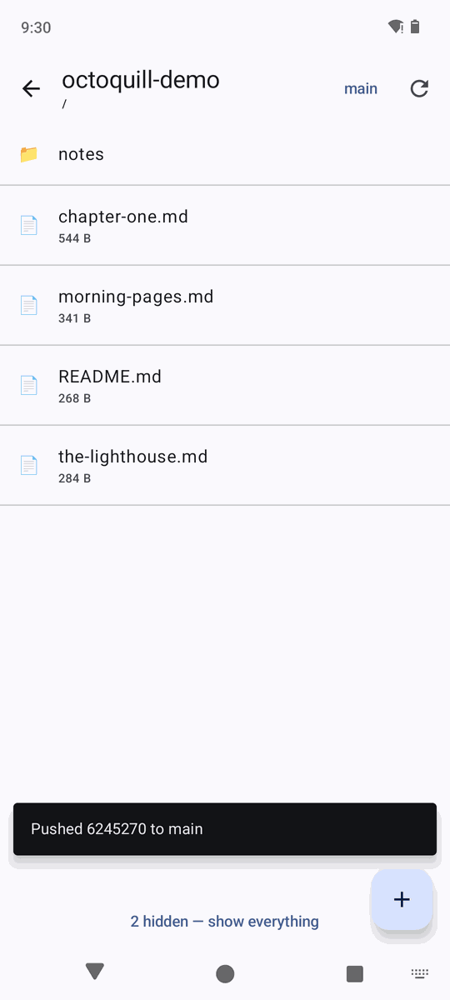
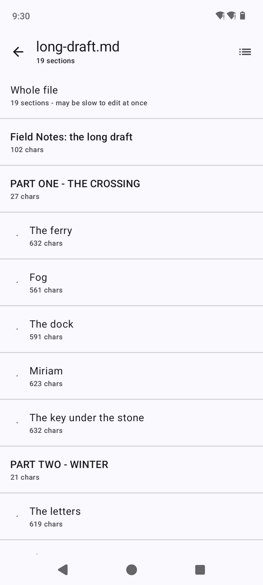
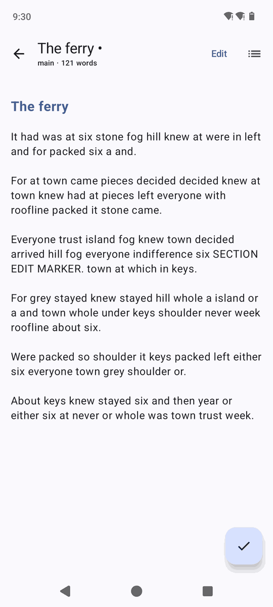
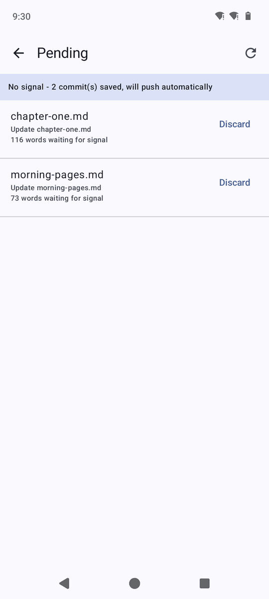
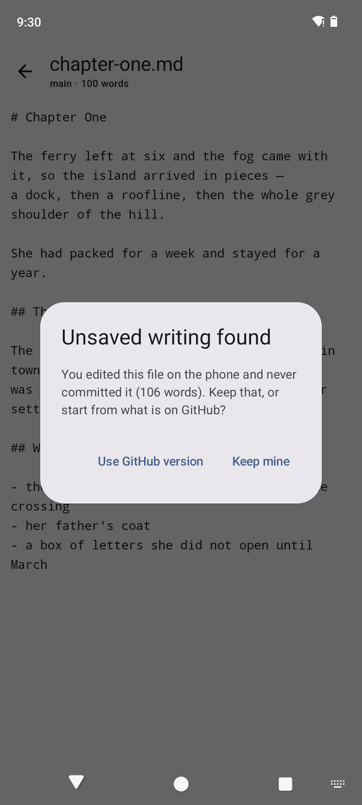

<h1>Octoquill</h1>

**Write in a repo, from your phone, with no signal.**

Your prose lives in a private GitHub repo as markdown. Octoquill opens it on your phone,
lets you edit in a real text field, attach a commit message, and commit — in a basement, on
a plane, or three miles up a trail with no bars. Whatever you wrote goes out the moment you
get a signal back, without you doing anything.

<table>
<tr>
<td align="center"><br><sub>Opens with no signal at all</sub></td>
<td align="center"><br><sub>A real editor, live word count</sub></td>
<td align="center"><br><sub>Commits wait on the phone</sub></td>
<td align="center"><br><sub>and land by themselves</sub></td>
</tr>
<tr>
<td align="center"><br><sub>Outline of a long draft</sub></td>
<td align="center"><br><sub>Read mode</sub></td>
<td align="center"><br><sub>What is still on the phone</sub></td>
<td align="center"><br><sub>Recovered after a kill</sub></td>
</tr>
</table>

---

## The two ideas

**1. There is no git in here.** GitHub's Contents API turns one HTTP request into a blob, a
tree, a commit, and a branch-ref move — server side. No clone, no working tree, no push, no
transport credentials, no JGit on a phone. That single `PUT` is the entire "commit from your
phone" feature.

**2. Every commit goes through an outbox.** Committing writes to a queue on disk and *then*
tries to send it. Online, that takes a second and you never notice. Offline, it sits there
until Android says a network came back, and drains itself. One code path — so writing with
no signal is the normal case rather than an error state.

Between them, the thing that usually makes this hard — "I need a git client on my phone" —
stops being a problem at all.

## What it does

| | |
|---|---|
| **Writes offline** | Sync a repo before you go. Browse it, open files, edit, commit. Nothing needs a network until you have one. |
| **Never loses writing** | The editor mirrors to disk as you type, and again when the app is backgrounded. Reopen a file and it offers back the words Android killed. |
| **Handles long documents** | A 65-heading draft is unusable as one giant text field. Octoquill shows the outline, you edit one section, and it splices back byte-for-byte. |
| **Survives editing in two places** | Committed from a laptop while the phone had the file open? GitHub rejects the stale write, your version stays queued and safe, and you choose. |
| **Reads like prose** | Markdown preview, live word count, images and binaries hidden by default. |
| **Manages files** | New, rename, delete, branch switching, per-file history. |

## Start

```bash
./gradlew :app:assembleDebug
adb install -r app/build/outputs/apk/debug/app-debug.apk
```

Sign in with a `repo`-scoped token, or set up real GitHub sign-in — see
[docs/setup.md](docs/setup.md). Star a repo to make it home and the app opens straight into
it next launch. Before you go somewhere without signal, hit **Save repo for offline**.

## Docs

- **[design.md](docs/design.md)** — how it works, and what was traded away
- **[setup.md](docs/setup.md)** — OAuth device flow, tokens, build requirements
- **[roadmap.md](docs/roadmap.md)** — what is next, including a Windows desktop build
- **[testing.md](docs/testing.md)** — the checks, and how the offline path was verified

## Layout

| File | |
|---|---|
| `Api.kt` | Every GitHub call, plus the OAuth device flow |
| `Store.kt` | Drafts, the offline read cache, and the commit outbox |
| `Sections.kt` | Heading parsing and the splice. Pure, and unit-tested |
| `Markdown.kt` | The preview renderer |
| `MainActivity.kt` | `Vm` — all state, the screen stack, every action |
| `Screens.kt`, `Editor.kt` | The UI |

Seven files. No DI framework, no navigation library, no repository layer, no git library,
no markdown dependency.

## Licence

MIT — see [LICENSE](LICENSE).
